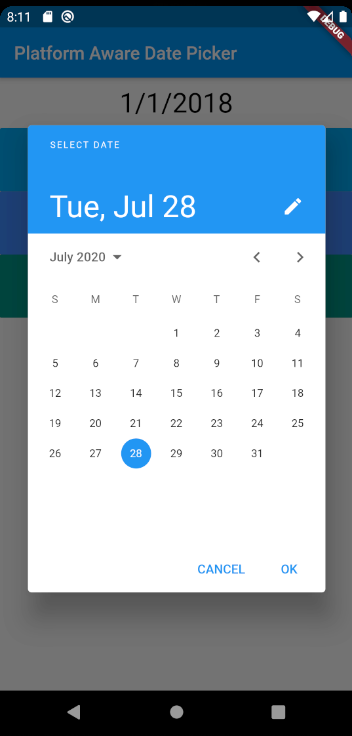
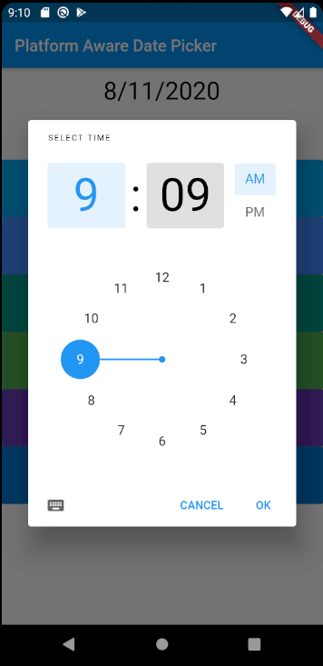
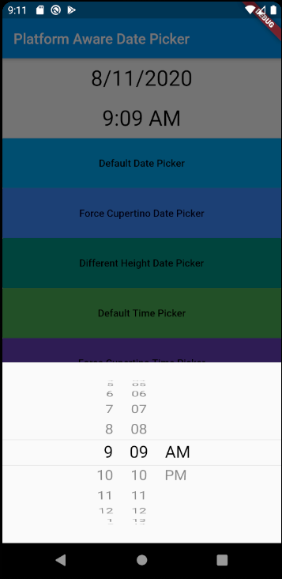
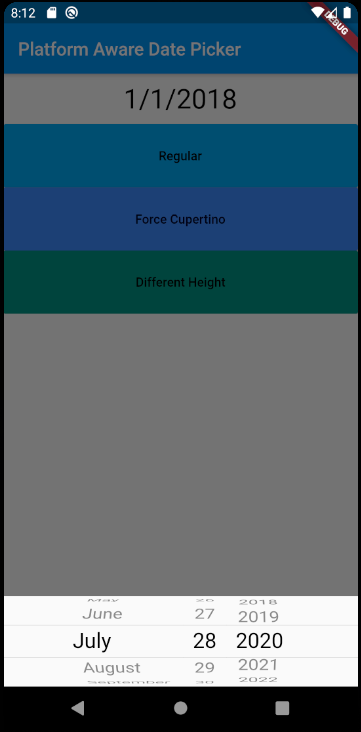
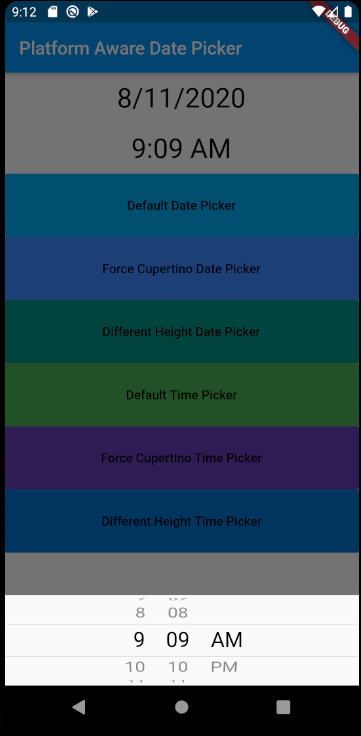

# Platform Aware Date Picker

This package will automatically show either the Cupertino or Material Date Picker and Time Picker depending on the platform specified.

## Usage

To use this plugin, add `platform_date_picker` as a dependency in your pubspec.yaml file.

## Getting Started

Simply call the static method `showDate()` or `showTime()` of the `PlatformDatePicker` class and it will show either the appropiate Date Picker depending on the platform. It returns a Future `DateTime` object if the user selects a date or time, otherwise it returns `null`. Pass in the same parameters as you would for calling the function `showDatePicker()` or `showTimePicker()`.

```
DateTime date = await PlatformDatePicker.showDate(
    context: context,
    firstDate: DateTime(DateTime.now().year - 2),
    initialDate: DateTime.now(),
    lastDate: DateTime(DateTime.now().year + 2),
);
```

 

You can also force the function to show either the Cupertino or Material date or time picker by setting the `showCupertino` or `showMaterial` fields.

```
TimeOfDay temp = await PlatformDatePicker.showTime(
    context: context,
    initialTime: TimeOfDay.fromDateTime(DateTime.now()),
    showCupertino: true,
);
```

 

Finally you can set the height of the Cupertino date or time picker by setting the `height` field. The default value is the bottom third of the screen.

 
